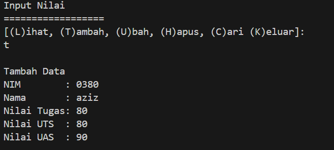
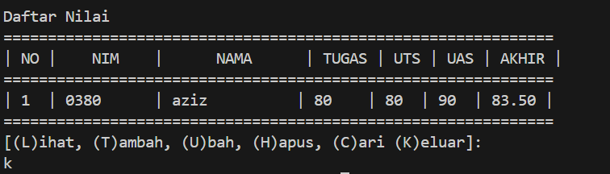
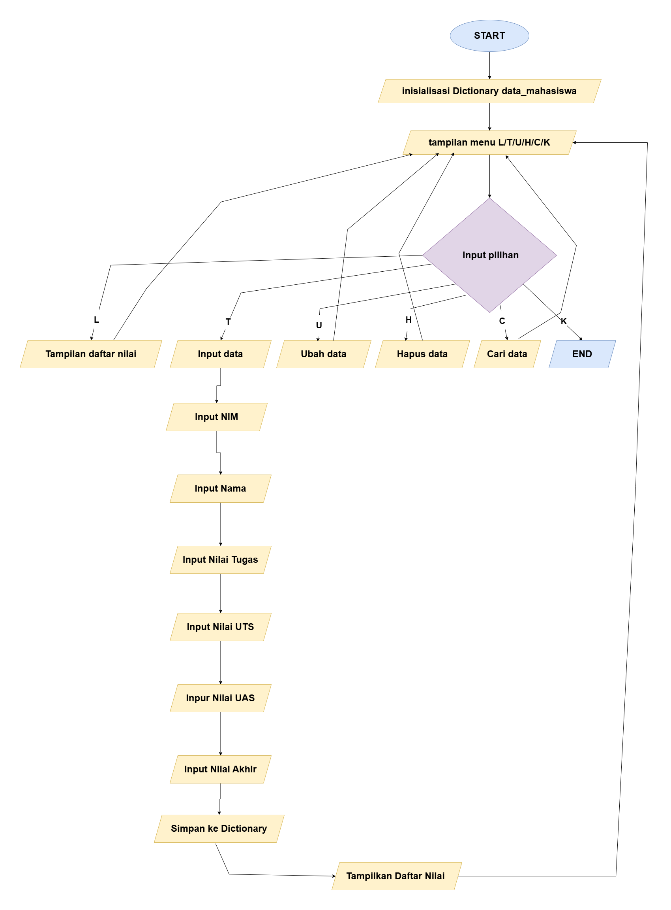

# TUGAS LABPY 05
# Data Diri

Nama : Muhammad Aziz Tri Ramadhan

NIM : 312410380

Kelas : TI,24.A.3

# input dan outpu dari LABPY 05
## input

## output

## flowchart

1. **Fungsi `hitung_nilai_akhir(tugas, uts, uas)`**:
   - Fungsi ini menerima tiga parameter: `tugas`, `uts`, dan `uas`.
   - Fungsi ini menghitung nilai akhir mahasiswa berdasarkan rumus:
     - Nilai Akhir = (Nilai Tugas × 30%) + (Nilai UTS × 35%) + (Nilai UAS × 35%)
   - Fungsi ini mengembalikan nilai akhir yang telah dihitung.

2. **Fungsi `tampilkan_menu()`**:
   - Fungsi ini mencetak menu pilihan program yang terdiri dari:
     - `[(L)ihat, (T)ambah, (U)bah, (H)apus, (C)ari (K)eluar]`
   - Fungsi ini tidak mengembalikan nilai apa pun, hanya mencetak menu ke layar.

3. **Fungsi `tampilkan_daftar(data_mahasiswa)`**:
   - Fungsi ini menerima satu parameter, yaitu `data_mahasiswa`, yang merupakan dictionary berisi data nilai mahasiswa.
   - Fungsi ini mencetak daftar nilai mahasiswa dalam format tabel yang rapi.
   - Jika `data_mahasiswa` kosong, maka akan dicetak pesan "TIDAK ADA DATA".
   - Fungsi ini tidak mengembalikan nilai apa pun, hanya mencetak daftar nilai ke layar.

4. **Fungsi `tambah_data(data_mahasiswa)`**:
   - Fungsi ini menerima satu parameter, yaitu `data_mahasiswa`, yang merupakan dictionary berisi data nilai mahasiswa.
   - Fungsi ini meminta pengguna untuk memasukkan data baru mahasiswa, yaitu NIM, Nama, Nilai Tugas, Nilai UTS, dan Nilai UAS.
   - Fungsi ini menghitung nilai akhir mahasiswa menggunakan fungsi `hitung_nilai_akhir()`.
   - Fungsi ini menambahkan data baru mahasiswa ke dalam `data_mahasiswa`.
   - Setelah menambahkan data, fungsi ini memanggil `tampilkan_daftar()` untuk menampilkan daftar nilai terbaru.
   - Fungsi ini tidak mengembalikan nilai apa pun, hanya melakukan proses penambahan data.

5. **Fungsi `main()`**:
   - Fungsi ini merupakan fungsi utama program.
   - Pertama-tama, fungsi ini menginisialisasi `data_mahasiswa` sebagai dictionary kosong.
   - Kemudian, fungsi ini masuk ke dalam loop `while True` yang akan berjalan terus-menerus hingga pengguna memilih untuk keluar.
   - Dalam loop tersebut, fungsi `tampilkan_menu()` dipanggil untuk menampilkan menu pilihan.
   - Pengguna diminta untuk memasukkan pilihan, yang kemudian diubah menjadi huruf kecil menggunakan `pilihan.lower()`.
   - Berdasarkan pilihan pengguna, program akan memanggil fungsi yang sesuai, yaitu:
     - Jika `l`, maka fungsi `tampilkan_daftar()` dipanggil.
     - Jika `t`, maka fungsi `tambah_data()` dipanggil, diikuti pemanggilan `tampilkan_daftar()`.
     - Jika `u`, `h`, atau `c`, maka fungsi-fungsi terkait (yang belum diimplementasikan) akan dipanggil.
     - Jika `k`, maka program akan keluar dari loop `while True`.
   - Jika pilihan pengguna tidak valid, program akan mencetak pesan "Pilihan tidak valid!".

6. **Blok `if __name__ == "__main__":`**:
   - Blok ini memastikan bahwa fungsi `main()` hanya akan dijalankan ketika program dijalankan secara langsung, dan tidak akan dijalankan jika program diimpor sebagai modul.
   - Blok ini mencetak judul program "Program Input Nilai" dan garis penutup "=" * 18.
   - Kemudian, fungsi `main()` dipanggil untuk menjalankan program.

